# Diagram Architektury UI - Moduł Autentykacji AI Tutor

## Przegląd

Ten diagram przedstawia kompletną architekturę interfejsu użytkownika dla modułu autentykacji w aplikacji AI Tutor. Obejmuje strony Astro (SSR), komponenty React (client-side), hooki, middleware oraz przepływ danych między nimi.

## Diagram Mermaid

```mermaid
flowchart TD
    %% ============================================================================
    %% GŁÓWNE SEKCJE
    %% ============================================================================
    
    subgraph "Middleware i Routing"
        MW["Middleware<br/>src/middleware/index.ts"]
        MW -->|"Sprawdza sesję"| MW_SESSION["Pobiera session z<br/>Supabase Auth"]
        MW_SESSION -->|"Dodaje do context.locals"| MW_CONTEXT["session, user,<br/>supabase client"]
        MW_CONTEXT -->|"Ochrona /app/*"| MW_PROTECT["Redirect niezalogowanych<br/>do /auth/login"]
        MW_CONTEXT -->|"Ochrona /auth/*"| MW_REDIRECT["Redirect zalogowanych<br/>do /app/dashboard"]
    end

    subgraph "Strony Publiczne - Astro SSR"
        direction TB
        
        subgraph "Strona Główna"
            INDEX["/ - index.astro<br/>[AKTUALIZOWANY]"]
            INDEX_WELCOME["Welcome.astro<br/>Linki do logowania/rejestracji"]
            INDEX --> INDEX_WELCOME
        end
        
        subgraph "Moduł Logowania"
            LOGIN_PAGE["/auth/login.astro<br/>[NOWY]"]
            LOGIN_FORM["LoginForm.tsx<br/>[NOWY - React Island]"]
            LOGIN_PAGE -->|"client:load"| LOGIN_FORM
            
            LOGIN_FORM_INPUTS["Inputs:<br/>• identifier email/login<br/>• hasło<br/>• kod dostępu pre-gate"]
            LOGIN_FORM --> LOGIN_FORM_INPUTS
            LOGIN_FORM --> AUTH_ERROR["AuthError.tsx<br/>Wyświetlanie błędów"]
            LOGIN_FORM -->|"Walidacja kodu"| API_VALIDATE["POST /api/auth/<br/>validate-access-code"]
            LOGIN_FORM -->|"Rozwiązanie login→email"| API_RESOLVE["POST /api/auth/<br/>resolve-identifier"]
            LOGIN_FORM -->|"Logowanie"| SUPABASE_AUTH["Supabase Auth<br/>signInWithPassword"]
        end
        
        subgraph "Moduł Rejestracji"
            REGISTER_PAGE["/auth/register.astro<br/>[NOWY]"]
            REGISTER_FORM["RegisterForm.tsx<br/>[NOWY - React Island]"]
            REGISTER_PAGE -->|"client:load"| REGISTER_FORM
            
            REGISTER_FORM_INPUTS["Inputs:<br/>• kod dostępu<br/>• login<br/>• email<br/>• hasło<br/>• potwierdzenie hasła"]
            REGISTER_FORM --> REGISTER_FORM_INPUTS
            REGISTER_FORM --> AUTH_ERROR
            REGISTER_FORM --> AUTH_SUCCESS["AuthSuccessMessage.tsx<br/>Komunikaty sukcesu"]
            REGISTER_FORM -->|"Rejestracja MVP"| API_REGISTER["POST /api/auth/register<br/>Zwraca session dla auto-login"]
        end
        
        subgraph "Moduł Reset Hasła"
            RESET_PAGE["/auth/reset-password.astro<br/>[NOWY]"]
            RESET_FORM["ResetPasswordForm.tsx<br/>[NOWY - React Island]"]
            RESET_PAGE -->|"client:load"| RESET_FORM
            
            RESET_FORM_INPUT["Input: email"]
            RESET_FORM --> RESET_FORM_INPUT
            RESET_FORM --> AUTH_SUCCESS
            RESET_FORM -->|"Reset hasła"| SUPABASE_RESET["Supabase Auth<br/>resetPasswordForEmail"]
        end
        
        subgraph "Moduł Zmiana Hasła"
            UPDATE_PAGE["/auth/update-password.astro<br/>[NOWY]"]
            UPDATE_FORM["UpdatePasswordForm.tsx<br/>[NOWY - React Island]"]
            UPDATE_PAGE -->|"client:load<br/>prop: isValidToken"| UPDATE_FORM
            
            UPDATE_FORM_INPUTS["Inputs:<br/>• nowe hasło<br/>• potwierdzenie hasła"]
            UPDATE_FORM --> UPDATE_FORM_INPUTS
            UPDATE_FORM --> AUTH_ERROR
            UPDATE_FORM --> AUTH_SUCCESS
            UPDATE_FORM -->|"Aktualizacja hasła"| SUPABASE_UPDATE["Supabase Auth<br/>updateUser password"]
        end
        
        subgraph "Endpoint Wylogowania"
            LOGOUT_PAGE["/auth/logout.astro<br/>[NOWY]<br/>Server-side only"]
            LOGOUT_PAGE -->|"Wylogowanie"| SUPABASE_SIGNOUT["Supabase Auth<br/>signOut"]
        end
    end

    subgraph "Strony Chronione - Astro SSR"
        direction TB
        
        subgraph "Dashboard"
            DASHBOARD_PAGE["/app/dashboard.astro<br/>[NOWY]<br/>Wymaga autentykacji"]
            DASHBOARD_SCREEN["DashboardScreen.tsx<br/>[NOWY - React Island]"]
            DASHBOARD_PAGE -->|"client:load"| DASHBOARD_SCREEN
        end
        
        subgraph "Profil Użytkownika"
            PROFILE_PAGE["/app/profile.astro<br/>[AKTUALIZOWANY]<br/>Wymaga autentykacji"]
            PROFILE_SCREEN["ProfileScreen.tsx<br/>[AKTUALIZOWANY - React Island]<br/>Usuń mock data, przyjmij userId"]
            PROFILE_PAGE -->|"client:load<br/>prop: userId"| PROFILE_SCREEN
            
            PROFILE_SCREEN --> PROFILE_HEADER["ProfileHeader.tsx"]
            PROFILE_SCREEN --> PROFILE_DETAILS["ProfileDetailsCard.tsx"]
            PROFILE_SCREEN --> PREFERENCES_FORM["PreferencesForm.tsx"]
            PROFILE_SCREEN --> TUTORIAL_SECTION["TutorialSection.tsx"]
            
            PREFERENCES_FORM --> THEME_TOGGLE["ThemeToggle.tsx"]
            PREFERENCES_FORM --> AUDIO_TOGGLE["AudioToggle.tsx"]
        end
    end

    subgraph "Hooki React"
        USE_AUTH["useAuth.ts<br/>[NOWY]<br/>• Pobiera sesję<br/>• Nasłuchuje zmian<br/>• signOut method"]
        USE_PROFILE["useProfile.ts<br/>[ISTNIEJĄCY]<br/>Pobiera dane profilu"]
        USE_PREFERENCES["usePreferences.ts<br/>[ISTNIEJĄCY]<br/>Zarządza preferencjami"]
        
        USE_AUTH -->|"Używane w"| LOGIN_FORM
        USE_AUTH -->|"Używane w"| PROFILE_SCREEN
        USE_AUTH -->|"Używane w"| DASHBOARD_SCREEN
        
        USE_PROFILE -->|"Używane w"| PROFILE_SCREEN
        USE_PREFERENCES -->|"Używane w"| PREFERENCES_FORM
    end

    subgraph "Komponenty UI Shadcn/ui"
        direction LR
        
        subgraph "Istniejące"
            UI_BUTTON["button.tsx"]
            UI_CARD["card.tsx"]
            UI_LABEL["label.tsx"]
            UI_SELECT["select.tsx"]
            UI_SKELETON["skeleton.tsx"]
            UI_SWITCH["switch.tsx"]
            UI_BADGE["badge.tsx"]
        end
        
        subgraph "Do Dodania"
            UI_INPUT["input.tsx<br/>[NOWY]<br/>Pola tekstowe z typami"]
            UI_FORM["form.tsx<br/>[NOWY]<br/>Form, FormField,<br/>FormMessage"]
            UI_ALERT["alert.tsx<br/>[NOWY]<br/>Info, success,<br/>warning, error"]
        end
    end

    subgraph "Komponenty Wspólne"
        LOADING_STATE["LoadingState.tsx<br/>[ISTNIEJĄCY]"]
        ERROR_STATE["ErrorState.tsx<br/>[ISTNIEJĄCY]"]
    end

    subgraph "Walidatory i Utilities"
        VALIDATORS["validators.ts<br/>[NOWY]<br/>• validateEmail<br/>• validateLogin<br/>• validatePassword<br/>• validatePasswordConfirm<br/>• validateAccessCode"]
        
        AUTH_ERRORS["auth-errors.ts<br/>[NOWY]<br/>Mapowanie błędów Supabase<br/>na komunikaty PL"]
        
        API_RESPONSE["api-response.ts<br/>[AKTUALIZOWANY]<br/>• createSuccessResponse<br/>• ErrorResponses<br/>• validationError"]
    end

    subgraph "Backend API Endpoints"
        direction TB
        
        API_VALIDATE
        API_RESOLVE
        API_REGISTER
        
        API_PROFILE_GET["GET /api/profile<br/>[ISTNIEJĄCY]<br/>Pobiera profil"]
        API_PROFILE_PUT["PUT /api/profile<br/>[ISTNIEJĄCY]<br/>Aktualizuje profil"]
        
        API_VALIDATE --> ACCESS_CODE_SERVICE["AccessCodeService<br/>[NOWY]<br/>• validateCode<br/>• markCodeAsUsed<br/>• generateCode"]
        API_REGISTER --> ACCESS_CODE_SERVICE
        
        API_PROFILE_GET --> PROFILE_SERVICE["ProfileService<br/>[ISTNIEJĄCY]<br/>• getProfile<br/>• isLoginAvailable<br/>• isEmailAvailable"]
        API_PROFILE_PUT --> PROFILE_SERVICE
    end

    subgraph "Layout i Struktura"
        LAYOUT["Layout.astro<br/>[POTENCJALNA AKTUALIZACJA]<br/>• Nawigacja<br/>• Link wylogowania<br/>• User info"]
        
        LAYOUT -->|"Osadza"| INDEX
        LAYOUT -->|"Osadza"| LOGIN_PAGE
        LAYOUT -->|"Osadza"| REGISTER_PAGE
        LAYOUT -->|"Osadza"| RESET_PAGE
        LAYOUT -->|"Osadza"| UPDATE_PAGE
        LAYOUT -->|"Osadza"| DASHBOARD_PAGE
        LAYOUT -->|"Osadza"| PROFILE_PAGE
    end

    %% ============================================================================
    %% PRZEPŁYWY DANYCH
    %% ============================================================================
    
    %% Przepływ rejestracji
    LOGIN_FORM -.->|"Kod poprawny,<br/>redirect z kodem"| REGISTER_PAGE
    REGISTER_FORM -.->|"MVP: Odbiera session<br/>w response"| REGISTER_FORM
    REGISTER_FORM -.->|"Auto-login,<br/>redirect"| DASHBOARD_PAGE
    
    %% Przepływ logowania
    LOGIN_FORM -.->|"Sukces logowania,<br/>redirect"| DASHBOARD_PAGE
    
    %% Przepływ reset hasła
    RESET_FORM -.->|"Email wysłany,<br/>link w mailu"| UPDATE_PAGE
    UPDATE_FORM -.->|"Hasło zmienione,<br/>redirect"| LOGIN_PAGE
    
    %% Przepływ wylogowania
    LOGOUT_PAGE -.->|"Redirect po wylogowaniu"| LOGIN_PAGE
    
    %% Użycie komponentów UI
    LOGIN_FORM -.->|"Używa"| UI_INPUT
    LOGIN_FORM -.->|"Używa"| UI_FORM
    LOGIN_FORM -.->|"Używa"| UI_BUTTON
    
    REGISTER_FORM -.->|"Używa"| UI_INPUT
    REGISTER_FORM -.->|"Używa"| UI_FORM
    REGISTER_FORM -.->|"Używa"| UI_BUTTON
    
    RESET_FORM -.->|"Używa"| UI_INPUT
    RESET_FORM -.->|"Używa"| UI_BUTTON
    
    UPDATE_FORM -.->|"Używa"| UI_INPUT
    UPDATE_FORM -.->|"Używa"| UI_BUTTON
    
    AUTH_ERROR -.->|"Używa"| UI_ALERT
    AUTH_SUCCESS -.->|"Używa"| UI_ALERT
    
    PROFILE_SCREEN -.->|"Używa na błędy"| ERROR_STATE
    PROFILE_SCREEN -.->|"Używa na ładowanie"| LOADING_STATE
    
    PROFILE_DETAILS -.->|"Używa"| UI_CARD
    PREFERENCES_FORM -.->|"Używa"| UI_SWITCH
    PREFERENCES_FORM -.->|"Używa"| UI_LABEL
    
    %% Walidacja
    LOGIN_FORM -.->|"Waliduje dane"| VALIDATORS
    REGISTER_FORM -.->|"Waliduje dane"| VALIDATORS
    UPDATE_FORM -.->|"Waliduje hasło"| VALIDATORS
    
    LOGIN_FORM -.->|"Mapuje błędy"| AUTH_ERRORS
    REGISTER_FORM -.->|"Mapuje błędy"| AUTH_ERRORS
    
    %% API responses
    API_VALIDATE -.->|"Używa"| API_RESPONSE
    API_RESOLVE -.->|"Używa"| API_RESPONSE
    API_REGISTER -.->|"Używa"| API_RESPONSE
    API_PROFILE_GET -.->|"Używa"| API_RESPONSE
    API_PROFILE_PUT -.->|"Używa"| API_RESPONSE
    
    %% Middleware flow
    MW -.->|"Przekazuje kontrolę"| INDEX
    MW -.->|"Przekazuje kontrolę"| LOGIN_PAGE
    MW -.->|"Przekazuje kontrolę"| DASHBOARD_PAGE
    MW -.->|"Przekazuje kontrolę"| PROFILE_PAGE
    
    %% ============================================================================
    %% STYLE
    %% ============================================================================
    
    classDef newComponent fill:#a8e6cf,stroke:#333,stroke-width:2px,color:#000
    classDef updatedComponent fill:#ffd3b6,stroke:#333,stroke-width:2px,color:#000
    classDef existingComponent fill:#e0e0e0,stroke:#333,stroke-width:1px,color:#000
    classDef middleware fill:#ffaaa5,stroke:#333,stroke-width:2px,color:#000
    classDef supabase fill:#b4a7d6,stroke:#333,stroke-width:2px,color:#000
    classDef api fill:#99d9ea,stroke:#333,stroke-width:2px,color:#000
    
    class LOGIN_PAGE,LOGIN_FORM,REGISTER_PAGE,REGISTER_FORM,RESET_PAGE,RESET_FORM,UPDATE_PAGE,UPDATE_FORM,LOGOUT_PAGE,AUTH_ERROR,AUTH_SUCCESS,USE_AUTH,UI_INPUT,UI_FORM,UI_ALERT,VALIDATORS,AUTH_ERRORS,API_VALIDATE,API_RESOLVE,API_REGISTER,ACCESS_CODE_SERVICE,DASHBOARD_PAGE,DASHBOARD_SCREEN newComponent
    
    class INDEX,INDEX_WELCOME,PROFILE_PAGE,PROFILE_SCREEN,LAYOUT,API_RESPONSE updatedComponent
    
    class PROFILE_HEADER,PROFILE_DETAILS,PREFERENCES_FORM,TUTORIAL_SECTION,THEME_TOGGLE,AUDIO_TOGGLE,USE_PROFILE,USE_PREFERENCES,UI_BUTTON,UI_CARD,UI_LABEL,UI_SELECT,UI_SKELETON,UI_SWITCH,UI_BADGE,LOADING_STATE,ERROR_STATE,API_PROFILE_GET,API_PROFILE_PUT,PROFILE_SERVICE existingComponent
    
    class MW,MW_SESSION,MW_CONTEXT,MW_PROTECT,MW_REDIRECT middleware
    
    class SUPABASE_AUTH,SUPABASE_RESET,SUPABASE_UPDATE,SUPABASE_SIGNOUT supabase
```

<mermaid_diagram>



</mermaid_diagram>

## Legenda

- 🟢 **Zielony** - Nowe komponenty do utworzenia
- 🟠 **Pomarańczowy** - Istniejące komponenty do aktualizacji
- ⚪ **Szary** - Istniejące komponenty bez zmian
- 🔴 **Czerwony** - Middleware i logika routingu
- 🟣 **Fioletowy** - Integracja z Supabase Auth

## Kluczowe przepływy

### 1. Przepływ rejestracji (MVP - auto-login)
```
User → /auth/login → wprowadza kod dostępu → walidacja
  → kod poprawny → /auth/register?code=... → wypełnia formularz
  → POST /api/auth/register → backend tworzy użytkownika (admin client)
  → backend zwraca session → frontend ustawia session
  → auto-login → redirect /app/dashboard
```

### 2. Przepływ logowania
```
User → /auth/login → wprowadza identifier (email/login) + hasło
  → POST /api/auth/resolve-identifier → otrzymuje email
  → Supabase Auth signInWithPassword
  → sukces → redirect /app/dashboard
```

### 3. Przepływ reset hasła
```
User → /auth/reset-password → wprowadza email
  → Supabase Auth resetPasswordForEmail
  → email wysłany → user klika link
  → /auth/update-password?token=... → wprowadza nowe hasło
  → Supabase Auth updateUser → sukces → redirect /auth/login
```

### 4. Middleware - ochrona zasobów
```
Każde żądanie → middleware → sprawdza sesję
  → /app/* bez sesji → redirect /auth/login?redirect=...
  → /auth/* z sesją → redirect /app/dashboard (wyjątki: logout, update-password)
  → dodaje session/user do context.locals → przekazuje kontrolę
```

## Fazy implementacji

### Faza 1: Infrastruktura
- Migracja tabeli `access_codes`
- Konfiguracja Supabase Auth
- Aktualizacja typów TypeScript

### Faza 2: Backend API
- `createAdminSupabaseClient()`
- `AccessCodeService`
- Endpointy: validate-access-code, resolve-identifier, register
- Aktualizacja `api-response.ts`

### Faza 3: Middleware i ochrona
- Aktualizacja middleware z logiką autentykacji
- Ochrona stron `/app/*`
- Dashboard

### Faza 4: Komponenty UI
- Shadcn/ui: input, form, alert
- Formularze autentykacji
- AuthError, AuthSuccessMessage

### Faza 5: Strony Astro
- Strony auth (login, register, reset, update, logout)
- Aktualizacja index i profile

### Faza 6: Hooki i walidatory
- useAuth hook
- validators.ts
- auth-errors.ts

### Faza 7: Aktualizacja profilu
- Usunięcie mock data z ProfileScreen
- Ochrona /app/profile

### Faza 8: Testy
- End-to-end testy przepływów
- Testy walidacji i błędów
- Testy responsywności

## Uwagi techniczne

### MVP: Auto-logowanie po rejestracji
- Kod dostępu walidowany przed rejestracją
- Użytkownik tworzony przez admin API z `email_confirm: true`
- Session zwracany w response z `/api/auth/register`
- Frontend automatycznie ustawia session w Supabase client
- Brak wymaganej weryfikacji email w MVP

### Bezpieczeństwo
- RLS policies na wszystkich tabelach
- JWT tokens w HTTP-only cookies
- Service role key tylko server-side
- Middleware jako główna warstwa ochrony
- Walidacja client-side i server-side

### Supabase Auth
- JWT expiry: 1 godzina
- Refresh token: automatyczny refresh
- Rate limiting: wbudowane w Supabase
- Email templates w języku polskim

